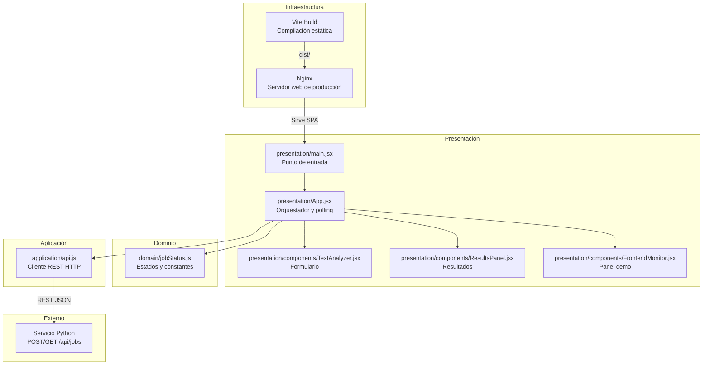

# Diagrama de Capas — Frontend (React + Nginx)

Arquitectura limpia del componente Frontend.

## Capas y archivos

| Capa | Archivo | Responsabilidad |
|---|---|---|
| **Presentación** | `src/presentation/App.jsx` | Estado global, envío y polling |
| **Presentación** | `src/presentation/components/TextAnalyzer.jsx` | Formulario de texto |
| **Presentación** | `src/presentation/components/ResultsPanel.jsx` | Muestra sentimiento y keywords |
| **Presentación** | `src/presentation/components/FrontendMonitor.jsx` | Panel visual de demo |
| **Dominio** | `src/domain/jobStatus.js` | Estados del job y constantes |
| **Aplicación** | `src/application/api.js` | Comunicación REST con Python |
| **Infraestructura** | `nginx.conf` | Servidor web ligero (producción) |
| **Infraestructura** | `Dockerfile` | Build multi-stage: Vite + Nginx |
