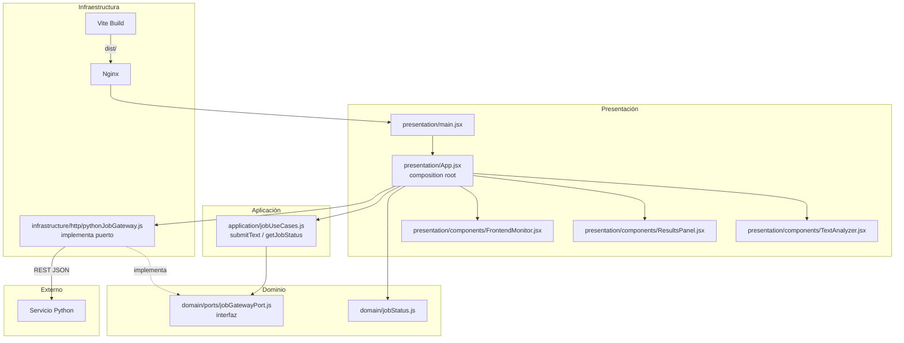

# Diagrama de Capas — Frontend (React + Nginx)

Arquitectura limpia con **inversión de dependencias**: los casos de uso dependen de `JobGatewayPort`, no de `fetch`.

## Regla de dependencia

| Capa | Depende de | No depende de |
|---|---|---|
| **Presentación** | Aplicación, Dominio, Infraestructura (solo wiring) | — |
| **Aplicación** | Dominio (**JobGatewayPort**) | fetch, URLs HTTP |
| **Dominio** | Nada externo | React, fetch |
| **Infraestructura** | Dominio (puerto) | Aplicación |

## Archivos clave

| Capa | Archivo | Responsabilidad |
|---|---|---|
| **Dominio** | `domain/ports/jobGatewayPort.js` | Contrato del gateway |
| **Aplicación** | `application/jobUseCases.js` | Casos de uso vía puerto |
| **Infraestructura** | `infrastructure/http/pythonJobGateway.js` | Adaptador fetch → Python |
| **Infraestructura** | `nginx.conf`, `Dockerfile` | Despliegue producción |
