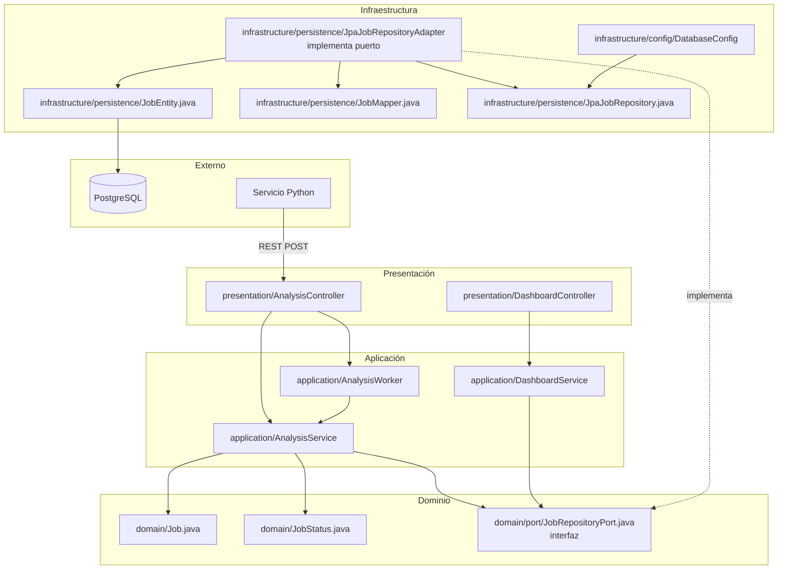

# Diagrama de Capas — Java Service (Spring Boot)

Arquitectura limpia con **inversión de dependencias**: `AnalysisService` depende de `JobRepositoryPort`, no de JPA.

## Regla de dependencia

| Capa | Depende de | No depende de |
|---|---|---|
| **Presentación** | Aplicación | Infraestructura concreta |
| **Aplicación** | Dominio (modelos + **JobRepositoryPort**) | JPA, JDBC, PostgreSQL |
| **Dominio** | Nada externo | Spring, JPA |
| **Infraestructura** | Dominio (puerto + modelos) | Aplicación |

## Archivos clave

| Capa | Archivo | Responsabilidad |
|---|---|---|
| **Dominio** | `domain/port/JobRepositoryPort.java` | Puerto de persistencia |
| **Aplicación** | `application/AnalysisService.java` | Lógica de análisis vía puerto |
| **Infraestructura** | `infrastructure/persistence/JpaJobRepositoryAdapter.java` | Adaptador JPA |
