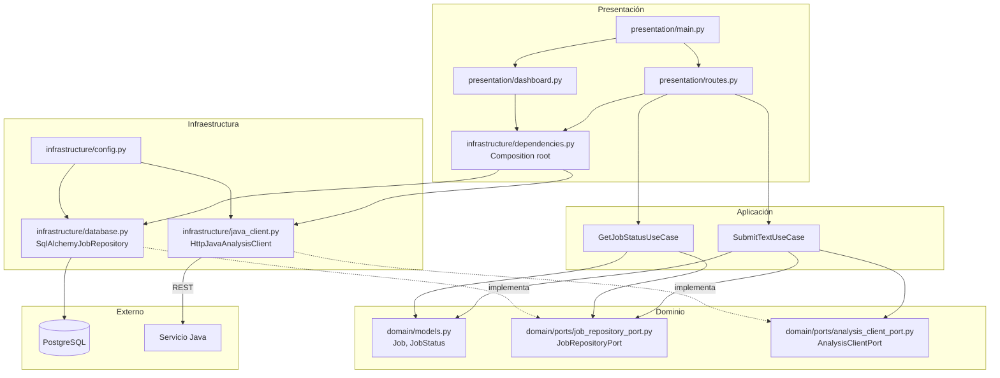

# Diagrama de Capas — Python Service (FastAPI)

Arquitectura limpia con **inversión de dependencias**: la aplicación depende de puertos (interfaces) definidos en el dominio; la infraestructura los implementa.

## Regla de dependencia

| Capa | Depende de | No depende de |
|---|---|---|
| **Presentación** | Aplicación, Dominio, Infraestructura (solo wiring) | — |
| **Aplicación** | Dominio (modelos + **puertos**) | Infraestructura concreta |
| **Dominio** | Nada externo | Aplicación, Infraestructura |
| **Infraestructura** | Dominio (puertos + modelos) | Aplicación |

## Archivos clave

| Capa | Archivo | Responsabilidad |
|---|---|---|
| **Dominio** | `domain/ports/job_repository_port.py` | Puerto de persistencia |
| **Dominio** | `domain/ports/analysis_client_port.py` | Puerto hacia Java |
| **Aplicación** | `application/use_cases.py` | Orquestación vía puertos |
| **Infraestructura** | `infrastructure/database.py` | Adaptador SQLAlchemy |
| **Infraestructura** | `infrastructure/java_client.py` | Adaptador HTTP |
| **Infraestructura** | `infrastructure/dependencies.py` | Inyección de adaptadores |
