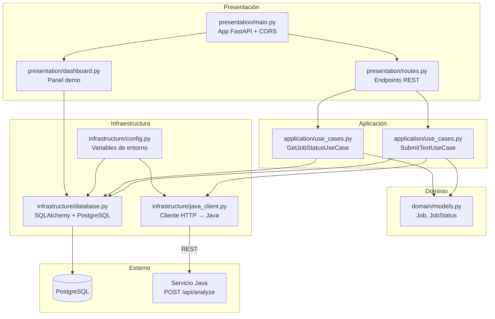

# Diagrama de Capas — Python Service (FastAPI)

Arquitectura limpia del Servicio de Submisión.

## Capas y archivos

| Capa | Archivo | Responsabilidad |
|---|---|---|
| **Presentación** | `presentation/routes.py` | `POST /api/jobs`, `GET /api/jobs/{id}` |
| **Presentación** | `presentation/main.py` | Configuración FastAPI, CORS, health |
| **Presentación** | `presentation/dashboard.py` | Panel visual de demo |
| **Aplicación** | `application/use_cases.py` | Lógica de negocio y orquestación |
| **Dominio** | `domain/models.py` | Entidad Job y enum JobStatus |
| **Infraestructura** | `infrastructure/database.py` | Persistencia en PostgreSQL |
| **Infraestructura** | `infrastructure/java_client.py` | Llamada REST al servicio Java |
| **Infraestructura** | `infrastructure/config.py` | `DATABASE_URL`, `JAVA_SERVICE_URL` |
